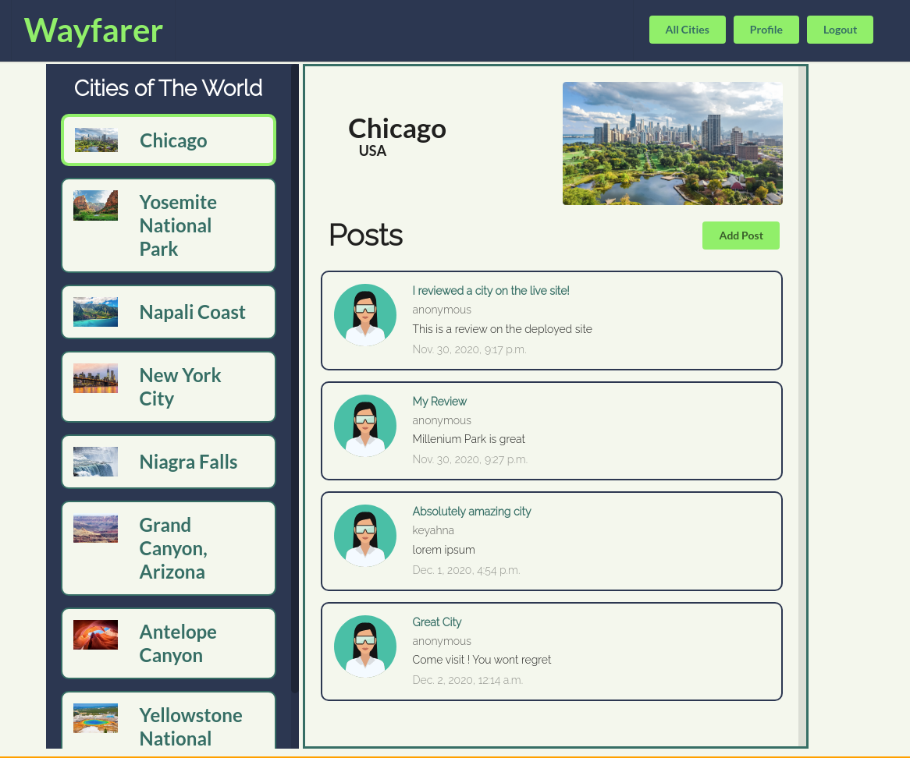

### [View site live here](https://wayfarer-group.herokuapp.com/) 

# Wayfarer Travel
> Travel review site for natural public spaces

## Table of contents
* [General info](#general-info)
* [Screenshots](#screenshots)
* [Technologies](#technologies)
* [Contact](#contact)

## General info
This is a travel review website for natural public spaces built with Django and PostgreSQL

## Screenshots

## Technologies
    * Django
    * PostgreSQL

## Features
    * User account registration
    * Post and Read reviews on landmarks across various cities
    * View all your reviews on your user account

## Contact
- [Ben Gordon](https://benjaminwgordon.github.io/portfolio/)
- [Keyahna Blanford](https://github.com/keyahnajanae)
- [Dylan Wannamaker](https://github.com/dwannamaker)
